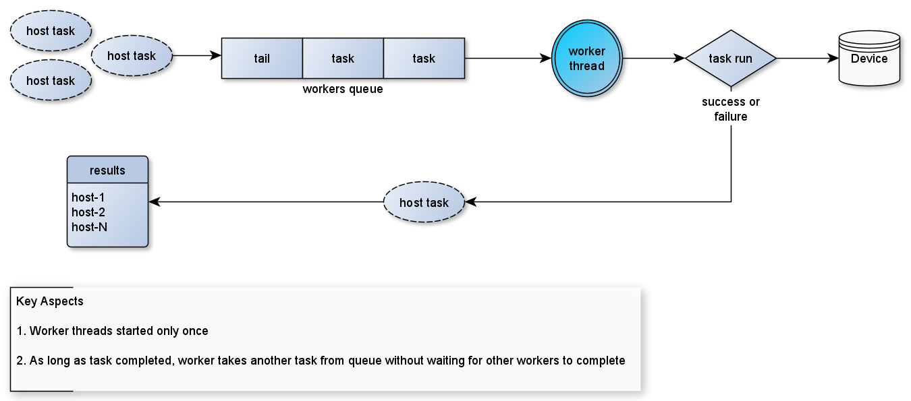
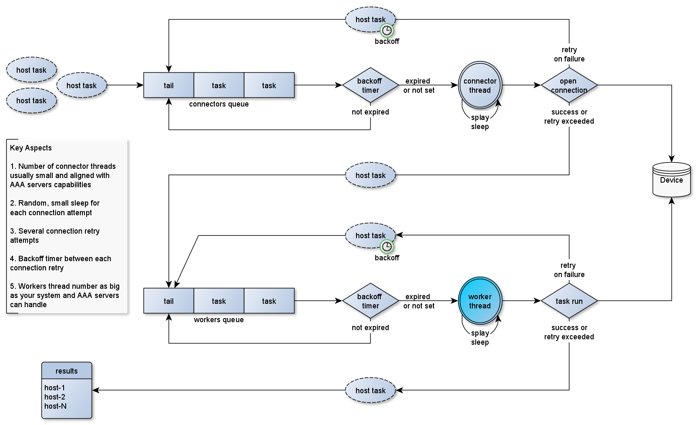

# nornir-salt
Collection of Nornir plugins used with [SALTSTACK Nornir modules](https://github.com/dmulyalin/salt-nornir). 

All plugins and functions can be used with Nornir directly.

# Installation

```
pip install nornir_salt
```

# Plugins

## Runner plugins

- **QueueRunner** - simple queue runner
- **RetryRunner** - runner that implements retry logic for connections and tasks, supports connecting to devices behind jumphost

## Inventory plugins

- **DictInventory** - Inventory plugin that accepts dictionary structure to populate hosts' inventory

## Functions

- **ResultSerializer** - helper function to transform AggregatedResult object in Python dictionary
- **FFun** - helper filter function, to filter Nornir hosts based on F-object, Glob patterns, groups, IP Prefix, list

## Tasks

- **tcp_ping** - task to TCP ping Nornir hosts, returns dictionary of pinged ports per host

# How and What

Additional details about how it works and usage samples

## QueueRunner

**Architecture**
  

Sample code to use QueueRunner, DictInventory and ResultSerializer

<details><summary>Code</summary>

```python
import yaml
import pprint
from nornir import InitNornir
from nornir.core.task import Result, Task
from nornir_netmiko import netmiko_send_command, netmiko_send_config
from nornir_salt.plugins.functions import ResultSerializer

inventory_data = """
hosts:
  R1:
    hostname: 192.168.1.151
    platform: ios
    groups: [lab]
  R2:
    hostname: 192.168.1.153
    platform: ios
    groups: [lab]
  R3:
    hostname: 192.168.1.154
    platform: ios
    groups: [lab]
    
groups: 
  lab:
    username: cisco
    password: cisco
"""

inventory_dict = yaml.safe_load(inventory_data)

NornirObj = InitNornir(
    runner={
        "plugin": "QueueRunner",
        "options": {
            "num_workers": 100
        }
    },
    inventory={
        "plugin": "DictInventory",
        "options": {
            "hosts": inventory_dict["hosts"],
            "groups": inventory_dict["groups"],
            "defaults": inventory_dict.get("defaults", {})
        }
    },
)

def _task_group_netmiko_send_commands(task, commands):
    # run commands
    for command in commands:
        task.run(
            task=netmiko_send_command,
            command_string=command,
            name=command
        )
    return Result(host=task.host)
    
# run single task
result1 = NornirObj.run(
    task=netmiko_send_command, 
    command_string="show clock"
)

# run grouped tasks
result2 = NornirObj.run(
    task=_task_group_netmiko_send_commands, 
    commands=["show clock", "show run | inc hostname"]
)

# run another single task
result3 = NornirObj.run(
    task=netmiko_send_command, 
    command_string="show run | inc hostname"
)

NornirObj.close_connections()

# Print results
formed_result1 = ResultSerializer(result1, add_details=True)
pprint.pprint(formed_result1, width=100)

formed_result2 = ResultSerializer(result2, add_details=True)
pprint.pprint(formed_result2, width=100)

formed_result3 = ResultSerializer(result3, add_details=True)
pprint.pprint(formed_result3, width=100)
```
</details>

## RetryRunner

> For grouped tasks need to explicitly provide `connection_name` attribute such as `netmiko`, `napalm`, `scrapli`. Specifying `connection_name` attribute for standalone tasks not required. Lack of `connection_name` attribute will result in skipping connection retry logic and connections to all hosts initiated simultaneously up to the number of `num_workers`

**Architecture**
  

Sample code to use RetryRunner, DictInventory and ResultSerializer

<details><summary>Code</summary>

```python
import yaml
import pprint
from nornir import InitNornir
from nornir.core.task import Result, Task
from nornir_netmiko import netmiko_send_command, netmiko_send_config
from nornir_salt.plugins.functions import ResultSerializer

inventory_data = """
hosts:
  R1:
    hostname: 192.168.1.151
    platform: ios
    groups: [lab]
  R2:
    hostname: 192.168.1.153
    platform: ios
    groups: [lab]
  R3:
    hostname: 192.168.1.154
    platform: ios
    groups: [lab]
    
groups: 
  lab:
    username: cisco
    password: cisco
"""

inventory_dict = yaml.safe_load(inventory_data)

NornirObj = InitNornir(
    runner={
        "plugin": "RetryRunner",
        "options": {
            "num_workers": 100,
            "num_connectors": 10,
            "connect_retry": 3,
            "connect_backoff": 1000,
            "connect_splay": 100,
            "task_retry": 3,
            "task_backoff": 1000,
            "task_splay": 100
        }
    },
    inventory={
        "plugin": "DictInventory",
        "options": {
            "hosts": inventory_dict["hosts"],
            "groups": inventory_dict["groups"],
            "defaults": inventory_dict.get("defaults", {})
        }
    },
)

def _task_group_netmiko_send_commands(task, commands):
    # run commands
    for command in commands:
        task.run(
            task=netmiko_send_command,
            command_string=command,
            name=command
        )
    return Result(host=task.host)
    
# run single task
result1 = NornirObj.run(
    task=netmiko_send_command, 
    command_string="show clock"
)

# run grouped tasks
result2 = NornirObj.run(
    task=_task_group_netmiko_send_commands, 
    commands=["show clock", "show run | inc hostname"],
    connection_name="netmiko"
)

# run another single task
result3 = NornirObj.run(
    task=netmiko_send_command, 
    command_string="show run | inc hostname"
)

NornirObj.close_connections()

# Print results
formed_result1 = ResultSerializer(result1, add_details=True)
pprint.pprint(formed_result1, width=100)

formed_result2 = ResultSerializer(result2, add_details=True)
pprint.pprint(formed_result2, width=100)

formed_result3 = ResultSerializer(result3, add_details=True)
pprint.pprint(formed_result3, width=100)
```
</details>

## Connect to hosts behind jumphost

Only Netmiko tasks, `connection_name="netmiko"`, support connecting via Jumphosts.

To connect to devices behind jumphost, need to define jumphost parameters in host's inventory data:

<details><summary>Code</summary>

```python
inventory_data = """
hosts:
  R1:
    hostname: 192.168.1.151
    platform: ios
    groups: [lab]
    data: 
      jumphost:
        hostname: 10.1.1.1
        port: 22
        password: jump_host_password
        username: jump_host_user
"""
```
</details>

## FFun usage

Nornir interacts with many devices and has it's own inventory, as a result
additional filtering capabilities introduced to narrow down tasks execution
to certain hosts/devices.

Filtering order

```
FO -> FB -> FG -> FP -> FL
```

If multiple filters provided, returned hosts must comply all checks - `AND` logic.

<details><summary>Code</summary>

```python
import pprint
import yaml
from nornir import InitNornir
from nornir_salt.plugins.functions import FFun

inventory_data = """
hosts:
  R1:
    hostname: 192.168.1.151
    platform: ios
    groups: [lab]
    data:
      role: core
      site: B1
  SW1:
    hostname: 192.168.2.144
    platform: nxos_ssh
    groups: [lab, pod1]
    data:
      role: access
      site: B3
      
groups: 
  lab:
    username: cisco
    password: cisco
  pod1:
    username: cisco@
    password: cisco      
"""

inventory_dict = yaml.safe_load(inventory_data)

NornirObj = InitNornir(
    inventory={
        "plugin": "DictInventory",
        "options": {
            "hosts": inventory_dict["hosts"],
            "groups": inventory_dict["groups"],
            "defaults": inventory_dict.get("defaults", {})
        }
    },
)

filtered_hosts = FFun(NornirObj, FB="R*", FG="lab", FP="192.168.1.0/24", FO={"role": "core"})

pprint.pprint(filtered_hosts.dict().get("inventory", {}).get("hosts"))

# should print:
# {'R1': {'connection_options': {},
#         'data': {'role': 'core', 'site': 'B1'},
#         'groups': ['lab'],
#         'hostname': '192.168.1.151',
#         'name': 'R1',
#         'password': 'cisco',
#         'platform': 'ios',
#         'port': None,
#         'username': 'cisco'}}
```
</details>

### FO - Filter Object

Filter using [Nornir Filter Object](https://nornir.readthedocs.io/en/latest/tutorial/inventory.html#Filter-Object)

Platform ios and hostname 192.168.217.7:

```
filtered_hosts = FFun(NornirObj, FO={"platform": "ios", "hostname": "192.168.217.7"})
```

Location B1 or location B2:

```
filtered_hosts = FFun(NornirObj, FO=[{"location": "B1"}, {"location": "B2"}])
```

Location B1 and platform ios or any host at location B2:

```
filtered_hosts = FFun(NornirObj, FO=[{"location": "B1", "platform": "ios"}, {"location": "B2"}])
```

### FB - Filter gloB

Filter hosts by name using Glob Patterns - [fnmatchcase](https://docs.python.org/3.4/library/fnmatch.html#fnmatch.fnmatchcase) method:

Match R1, R2, R# hostnames but not R11 or R4:

```
filtered_hosts = FFun(NornirObj, FB="R[123]")
```

### FG - Filter Group

Filter hosts by group returning all hosts that belongs to given group:

```
filtered_hosts = FFun(NornirObj, FG="lab")
```

### FP - Filter Prefix

Filter hosts by checking if hosts hostname is part of at least one of given IP Prefixes::

```
filtered_hosts = FFun(NornirObj, FP="192.168.217.0/29, 192.168.2.0/24")
``` 

If host's inventory hostname is IP, will use it as is, if it is FQDN, will
attempt to resolve it to obtain IP address, if DNS resolution fails, host
fails the check.

### FL - Filter List

Match only hosts with names in provided list::

```
filtered_hosts = FFun(NornirObj, FL="R1, R2")
``` 